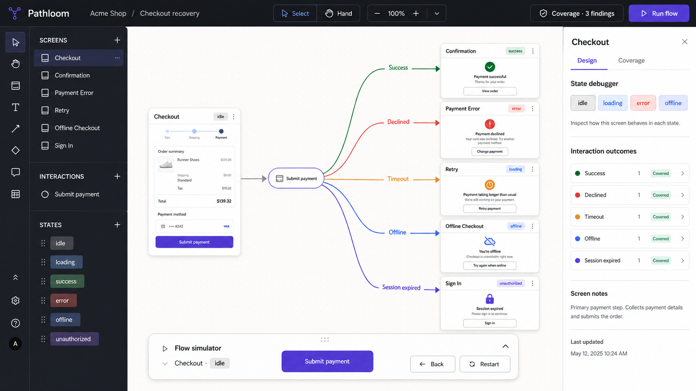

# Pathloom Product Spec and Delivery Plan

Status: **MVP v0.1 — vertical slice implemented**
Last updated: **2026-09-07**
Repository: [CodeTanim/Path-loom](https://github.com/CodeTanim/Path-loom)

This document is the working contract for Pathloom. Product behavior is specified here before it is expanded in code. A milestone is complete only when its exit criteria pass.

## 1. Product definition

Pathloom is a lightweight design and prototyping tool for user flows, application states, and edge cases.

Most prototyping tools answer: **What does the next screen look like?** Pathloom also answers:

- What can happen after an action?
- Which UI state is visible at each point?
- What happens when the happy path fails?
- Which branches, states, or destinations are missing?
- Can a designer walk the exact journey they modeled?

The core model is a state graph:

```text
Checkout · idle
  └─ Submit payment
      ├─ Success         → Confirmation · success
      ├─ Declined        → Payment Error · error
      ├─ Timeout         → Retry · error
      ├─ Offline         → Offline Checkout · offline
      └─ Session expired → Sign In · unauthorized
```

### Positioning

> Figma helps you design screens. Pathloom helps you design and debug what happens between and around those screens.

### Initial user

A product designer or product-minded engineer mapping a feature flow before implementation, especially one with asynchronous work, permissions, empty data, connectivity failures, or recovery paths.

### Primary job to be done

“When I design a product flow, help me model every meaningful outcome and preview the exact resulting UI state so I can find gaps before handoff or implementation.”

## 2. Product principles

1. **Behavior is first-class.** A branch is structured data, not a label drawn on a line.
2. **State is explicit.** A destination means a screen and a state, not only a screen.
3. **The graph is the source of truth.** Canvas, simulator, and coverage report are projections of the same document.
4. **Failure paths are normal paths.** Error, offline, empty, and unauthorized states receive the same treatment as success.
5. **Start lightweight.** The MVP proves authoring, simulation, and analysis before adding a full visual-design engine or collaboration.
6. **No false confidence.** Coverage metrics must have a defensible denominator and clearly distinguish warnings from errors.

## 3. Core terminology

| Term | Meaning |
| --- | --- |
| Project | One serializable Pathloom document. |
| Screen | A user-visible product surface, such as Checkout or Sign In. |
| State | A named presentation of a screen, such as idle, loading, error, or offline. |
| Interaction | An action or event available from a screen or a specific screen state. |
| Outcome | One possible result of an interaction. |
| Target | The destination `(screen, state)` pair for an outcome. |
| Entry | The first `(screen, initial state)` in simulation and reachability analysis. |
| Terminal | An intentional end to a journey. |
| Unresolved branch | An outcome intentionally sketched without a target yet. |
| Broken branch | A reference to a screen or state that does not exist. |
| Dead end | A reachable, non-terminal state with no valid outgoing path. |

## 4. MVP scope

The MVP is one polished, local-first checkout-recovery vertical slice. It must prove the whole Pathloom loop:

```text
Author a screen/state/action/outcome
  → inspect the graph
  → simulate the exact state transition
  → detect a coverage gap
  → repair it
  → undo the repair
```

### P0 — required for MVP

- A pannable, zoomable state-graph canvas.
- Selectable and movable screen and interaction nodes.
- Create a screen with an initial state.
- Create an interaction from a screen or a specific state.
- Add multiple outcomes to one interaction.
- Edit interaction trigger, outcome name/kind, target screen, and target state.
- Explicit core UI states: idle, loading, success, empty, error, offline, and unauthorized.
- State debugger that previews any state defined on the selected screen.
- Flow simulator whose cursor is an exact `(screenId, stateId)` pair.
- Coverage checks for unresolved branches, broken references, missing required states, unreachable nodes, and reachable dead ends.
- Quick fixes that are semantically valid for the selected finding.
- Undo/redo for document mutations and node movement.
- Local persistence with a versioned document schema.
- Seeded checkout example containing both happy and recovery paths.

### P1 — after the MVP gate

- Rename and delete for screens, states, interactions, and outcomes.
- Keyboard-first connection and editing workflows.
- Auto-layout and minimap.
- Rich branch conditions and guards.
- Import/export as Pathloom JSON.
- Reusable stateful components.
- Screen-level text, shape, resize, and component editing.

### Explicit non-goals for this milestone

- Real-time multiplayer or comments.
- Accounts, organizations, permissions, or cloud project storage.
- Pixel-complete replacement for Figma.
- Figma import/export.
- Production design-system integration.
- Variables, executable business logic, or a general app runtime.
- Mobile/tablet editor support.
- AI-generated flows.

These are deferred, not rejected. They must not complicate the MVP document model without a concrete use case.

## 5. Required user experience

### Approved visual direction



This concept is the visual reference for the MVP: familiar professional editor chrome, a graph-first canvas, compact screen previews, semantic branch colors, a state debugger, and an in-context simulation tray. It guides hierarchy and interaction design rather than acting as a pixel-for-pixel implementation requirement.

### Workspace layout

- **Top bar:** Pathloom identity, project context, mode, undo/redo, coverage status, and simulator launch.
- **Left rail:** creation tools, screen/action outline, reachability grouping, and search.
- **Canvas:** screens, interaction nodes, outcome edges, selection, pan, zoom controls, and move.
- **Right inspector:** selected-item properties, state inventory/debugger, outcome editor, and coverage findings.
- **Simulation tray:** current screen/state, available interactions, branch choices, history, back, and restart.

### Primary authoring flow

1. User creates or selects a screen.
2. User adds the states that matter for that screen.
3. User creates an interaction and chooses its source screen/state and trigger.
4. User adds one or more named outcomes.
5. For every outcome, user chooses its semantic kind and target screen/state, or deliberately leaves it unresolved.
6. Canvas updates immediately from the project document.
7. Coverage reruns immediately and reports remaining gaps.

### Simulation rules

- Simulation starts at the entry screen's valid initial state.
- Only interactions available from the current screen and current state may run.
- A node-wide interaction (`sourceStateId: null`) is available from every state of that screen.
- Choosing an outcome moves to its explicit target state, or the target screen's valid initial state when no target state is specified.
- An unresolved or broken outcome cannot advance simulation and must be identified clearly.
- A terminal screen completes the journey.
- A reachable non-terminal state with no valid action is an unhandled dead end, not a successful completion.

### Coverage rules

Analysis traverses `(screenId, stateId)` pairs from the entry state. It must never infer reachability from a screen name alone.

The MVP reports:

- Missing or invalid entry screen/state.
- Missing interaction source screen/state.
- Missing outcome target screen/state.
- Unresolved outcomes.
- Screens unreachable from every reachable state path.
- Reachable non-terminal states with no valid outgoing outcome.
- Required core state kinds missing from a screen.

Coverage UI shows concrete finding counts and a labeled reachability ratio. It must not manufacture a percentage from an arbitrary issue penalty.

## 6. Document contract and invariants

`ProjectDocument` is JSON-compatible, schema-versioned, and renderer-independent.

Required invariants:

1. Every node, state, interaction, and outcome ID is stable and unique within its scope.
2. `entryNodeId` resolves to a node with a valid `initialStateId`.
3. Every non-empty `sourceStateId` belongs to the interaction's source node.
4. Every non-empty target `stateId` belongs to the target node.
5. A target with `stateId: null` resolves through a valid target-node initial state.
6. Terminal nodes do not expose interactions.
7. Canvas coordinates are presentation data; they do not determine graph semantics.
8. React Flow objects are derived views and are never the persisted source of truth.
9. Simulator history and current selection are ephemeral UI state, not project data.
10. Breaking schema changes require a version bump and migration before persisted documents are loaded; additive optional fields must remain backward-compatible.

## 7. Milestone plan

Work proceeds in order. New milestone work starts only after the previous exit gate is met.

### M0 — Product contract

Status: **Complete**

- [x] Name and positioning fixed as Pathloom.
- [x] Core user, problem, vocabulary, and non-goals documented.
- [x] MVP workflow and acceptance criteria documented.
- [x] Reconcile the current build with every P0 semantic rule in this spec.

Exit gate: this document and domain vocabulary match the product shown in the editor.

### M1 — Trustworthy graph model

Status: **Complete**

- [x] Serializable schema-versioned domain model.
- [x] Seeded checkout recovery document.
- [x] Pure analyzer with unit tests.
- [x] State-pair reachability and dead-end analysis.
- [x] Initial-state and terminal-node invariant checks.
- [x] Tests for invalid state-scoped paths and implicit target states.

Exit gate: domain tests cover valid, unresolved, broken, unreachable, and state-scoped flows; lint and TypeScript pass.

### M2 — Complete authoring loop

Status: **Complete**

- [x] Canvas navigation, selection, and node movement.
- [x] Screen creation and basic connection gesture.
- [x] State debugger and previews.
- [x] Interaction creation.
- [x] Multi-outcome creation and editing.
- [x] Target screen/state editing.
- [x] Contextual fixes or guided repairs that preserve the author’s intent.
- [x] All authored paths visible on the graph.

Exit gate: a user can create an interaction with multiple named outcomes targeting distinct exact states without editing source code.

### M3 — State-accurate simulation

Status: **Complete**

- [x] Run, branch choice, history, back, and restart UI.
- [x] Cursor tracks both screen and state.
- [x] Available interactions respect source state.
- [x] Terminal completion and unhandled dead ends are distinct.
- [x] Unresolved/broken choices explain why they cannot advance.

Exit gate: each seeded outcome lands on the correct screen preview and exact state; no unavailable state-scoped action is offered.

### M4 — UX coverage and repair

Status: **Complete**

- [x] Findings panel and live rerun after document changes.
- [x] Coverage uses the state-aware analyzer.
- [x] Reachability metric has a clear numerator and denominator.
- [x] Repairs are based on the actual finding, state, and outcome kind.
- [x] Fixed documents can reach zero actionable findings.

Exit gate: seeded intentional gaps are detected, repairable, and undoable with no contradictory simulator result.

### M5 — MVP hardening and first push

Status: **Complete**

- [x] Replace starter branding and remove unused scaffold assets.
- [x] Keyboard and pointer smoke test.
- [x] Persistence reload smoke test.
- [x] Responsive guard for unsupported narrow viewports.
- [x] ESLint, TypeScript, unit tests, and production build pass.
- [x] Browser QA shows no console or runtime errors.
- [x] Commit and push the first coherent version to `CodeTanim/Path-loom`.

Exit gate: a new contributor can clone, install, run, understand, and exercise the full MVP loop from the README.

### MVP verification record — 2026-09-07

- Domain, saved-document, and graph-projection suites pass with 35 tests.
- ESLint, a sequential TypeScript check, and the Next.js production build with webpack pass.
- Browser QA repaired the seeded flow from three findings to zero, undid and redid a coverage repair with keyboard shortcuts, verified Undo after node movement, and restored the valid local draft after reload.
- The authoring smoke added another outcome to an interaction and targeted it at a distinct screen/state entirely through the inspector.
- Each repaired Submit payment outcome reached its exact named destination state; state-scoped actions, terminal completion, and read-only simulation inspection behaved as specified.
- The unsupported narrow-viewport guard rendered correctly, and the exercised flow produced no console warnings or runtime errors.
- The first coherent MVP checkpoint was pushed in commit [`584394d`](https://github.com/CodeTanim/Path-loom/commit/584394d); subsequent hardening continues in coherent verified commits.

## 8. MVP release acceptance criteria

The vertical slice is ready to call an MVP only when all are true:

1. From the UI, create one screen, two states, one interaction, and at least two outcomes targeting different `(screen, state)` pairs.
2. Simulating each outcome reaches the same exact state displayed by its graph target.
3. An interaction scoped to an unreachable state cannot make its target reachable in coverage.
4. An invalid initial state, source state, or target state produces a specific error.
5. A reachable non-terminal dead end is reported; a terminal state is treated as intentional completion.
6. Unresolved outcomes and unreachable screens are repairable without seeded-ID assumptions.
7. Undo and redo restore both project data and canvas positions predictably.
8. Reloading restores the last valid local document; corrupt or incompatible data falls back safely.
9. All real paths represented in the document are visible or hidden only by an explicit user-controlled filter.
10. Lint, TypeScript, unit tests, production build, and browser smoke test pass.

## 9. Quality and delivery guardrails

- Keep one authoritative document model; do not patch the renderer as a second database.
- Add or update domain tests before declaring semantic graph behavior complete.
- Prefer one finished end-to-end path over multiple half-built feature areas.
- Keep demo-specific content in sample data, not analyzer or editor logic.
- Record scope changes in this file before implementation.
- Preserve accessible names, keyboard focus, contrast, and reduced-motion behavior.
- Do not copy source from the reference Figma clone while it has no license; adapt ideas and interaction patterns only.
- Commit at coherent milestone boundaries, with the working tree verified first.

## 10. Later roadmap

After the MVP gate:

1. Screen composer: text, shapes, resize, layers, and reusable components.
2. Project/file management and IndexedDB persistence.
3. Conditions, variables, guards, and data fixtures for richer simulations.
4. Authenticated collaboration with granular shared domain structures.
5. Auto-layout, trapped-cycle detection, compare paths, and coverage policies.
6. Design-system adapters and permission-safe Figma import/export.

## 11. Open decisions

- Whether a state transition within one screen should be modeled as an outcome target or as a distinct lightweight transition type.
- Whether required states are inferred from outcome semantics, explicitly configured per node, or both.
- Whether the first persistence format should use IndexedDB snapshots, an append-only command log, or both.
- What minimum screen-composer feature set is necessary before design-system integration becomes useful.

Until decided, implementation should preserve the typed document boundary and avoid coupling these choices to the canvas renderer.
